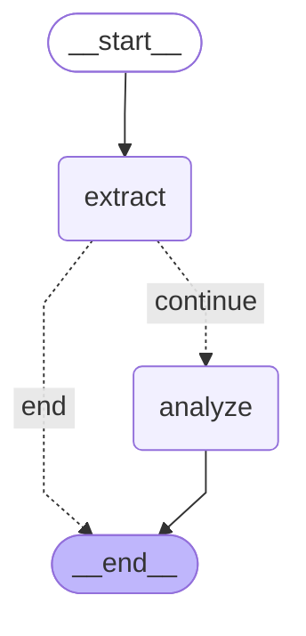

# 🎬 Agente IA YouTube - Video Analysis API

API REST que analiza videos de YouTube utilizando un flujo de agentes orquestado con **LangGraph**. Extrae transcripciones, realiza análisis de sentimiento/tono y genera resúmenes estructurados.

## 🚀 Características

- ✅ Extracción automática de transcripciones de YouTube
- ✅ Análisis de sentimiento (positivo/negativo/neutral)
- ✅ Detección de tono del orador
- ✅ Generación de 3 puntos clave
- ✅ Persistencia en PostgreSQL
- ✅ API asíncrona con Django REST Framework
- ✅ Multi-proveedor LLM: Soporte para Gemini y Groq (fácilmente extensible)

## 📋 Requisitos Previos

- Python 3.12+
- Docker & Docker Compose
- API Key de Google Gemini

## 🛠️ Instalación

### 1. Clonar el repositorio

```bash
git clone <repository-url>
cd agente-ia-youtube
```

### 2. Configurar variables de entorno

```bash
cp .env.example .env
# Editar .env con tus credenciales
```

Variables requeridas:
| Variable | Descripción | Default |
|----------|-------------|---------|
| `LLM_PROVIDER` | Proveedor LLM: `gemini` o `groq` | `gemini` |
| `GOOGLE_API_KEY` | API Key de Google Gemini | - |
| `GEMINI_MODEL` | Modelo de Gemini a usar | `gemini-2.0-flash` |
| `GROQ_API_KEY` | API Key de Groq (si usas Groq) | - |
| `GROQ_MODEL` | Modelo de Groq a usar | `llama-3.3-70b-versatile` |
| `POSTGRES_DB` | Nombre de la base de datos | - |
| `POSTGRES_USER` | Usuario de PostgreSQL | - |
| `POSTGRES_PASSWORD` | Contraseña de PostgreSQL | - |
| `POSTGRES_HOST` | Host (usar `db` para Docker) | - |
| `POSTGRES_PORT` | Puerto | `5432` |

### 3. Levantar con Docker

```bash
docker-compose up --build
```

### 4. Ejecutar migraciones (primera vez)

```bash
docker-compose exec web python manage.py migrate
```

## 📡 API Endpoints

### POST `/api/v1/videos/analyze/`

Analiza un video de YouTube y devuelve el análisis estructurado.

**Request:**
```json
{
  "video_url": "https://www.youtube.com/watch?v=VIDEO_ID"
}
```

**Response (201 Created):**
```json
{
  "id": 1,
  "url": "https://www.youtube.com/watch?v=VIDEO_ID",
  "title": "Título del video",
  "transcript": "Transcripción completa...",
  "duration_seconds": 300,
  "language_code": "es",
  "sentiment": "positivo",
  "sentiment_score": 0.85,
  "tone": "educativo",
  "key_points": [
    "Punto clave 1",
    "Punto clave 2",
    "Punto clave 3"
  ],
  "created_at": "2026-02-05T12:00:00Z"
}
```

## 🏗️ Arquitectura del Flujo (LangGraph)



### Nodos del Grafo

| Nodo | Función |
|------|---------|
| `extract` | Obtiene transcripción y metadata del video |
| `analyze` | Analiza sentimiento, tono y puntos clave con LLM |

## 🔄 Cambiar Proveedor LLM

El proyecto soporta múltiples proveedores de LLM. Para cambiar entre ellos:

### Usar Groq (recomendado - free tier generoso)

```bash
# En .env
LLM_PROVIDER=groq
GROQ_API_KEY=tu_api_key  # Obtener en https://console.groq.com/
GROQ_MODEL=llama-3.3-70b-versatile
```

### Usar Gemini

```bash
# En .env
LLM_PROVIDER=gemini
GOOGLE_API_KEY=tu_api_key  # Obtener en https://aistudio.google.com/
GEMINI_MODEL=gemini-2.0-flash
```

### Modelos Disponibles

| Proveedor | Modelos |
|-----------|----------|
| **Groq** | `llama-3.3-70b-versatile`, `llama-3.1-8b-instant`, `mixtral-8x7b-32768` |
| **Gemini** | `gemini-2.0-flash`, `gemini-2.0-flash-lite`, `gemini-1.5-flash` |

## 🧪 Tests

```bash
# Instalar dependencias de desarrollo
poetry install

# Ejecutar tests
poetry run pytest

# Con cobertura
poetry run pytest --cov=src
```

## 📁 Estructura del Proyecto

```
agente-ia-youtube/
├── src/
│   ├── application/
│   │   ├── use_cases/      # Casos de uso
│   │   └── workflow/       # Grafo LangGraph
│   ├── domain/
│   │   └── models.py       # Modelos Pydantic
│   ├── infrastructure/
│   │   ├── adapters/       # YouTube adapter, LLM adapters
│   │   │   └── llm/        # Abstracción multi-proveedor
│   │   ├── api/            # Views, Serializers
│   │   └── persistence/    # Django models
│   └── config/             # Settings, URLs
├── tests/                  # Tests unitarios e integración
├── manage.py
├── pyproject.toml
├── Dockerfile
└── docker-compose.yml
```

## 🔧 Desarrollo Local

```bash
# Crear entorno virtual
python -m venv .venv
.venv\Scripts\activate  # Windows

# Instalar dependencias
poetry install

# Correr servidor
set PYTHONPATH=src
python manage.py runserver
```

## 📄 Licencia

Tomas Daniel Gonzalez